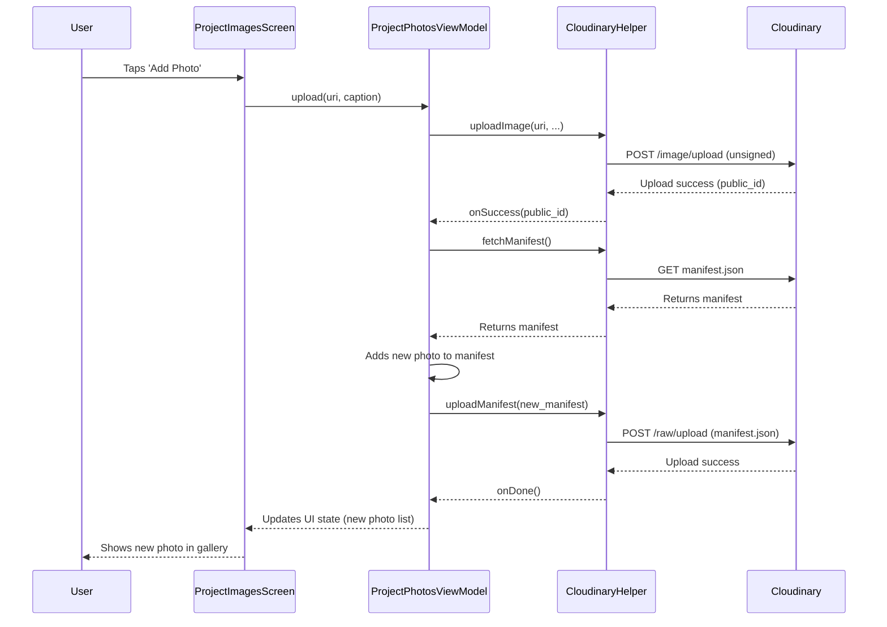

# UML Diagrams

This document provides UML (Unified Modeling Language) diagrams to visualize the architecture and interactions within the Xamu Wetlands field app. 

---

## 1. High-Level Component Diagram

This diagram shows the major components of the Android application and their dependencies, illustrating the MVVM (Model-View-ViewModel) architecture.

```mermaid
graph TD
    A[UI Layer (Compose Screens)] --> B(ViewModels)
    B --> C{Repositories}
    C --> D[Firebase Services]
    C --> E[Cloudinary Service]
    C --> F[Local Database (Room)]
    
    style A fill:#cde4ff
    style B fill:#cde4ff
    style C fill:#cde4ff
    style D fill:#f9d423
    style E fill:#f9d423
    style F fill:#f9d423
```

- **UI Layer**: The user interface, built with Jetpack Compose.
- **ViewModels**: Manages UI state and business logic.
- **Repositories**: Abstract the data sources, providing a clean API for the ViewModels.
- **Firebase, Cloudinary, Room**: The data sources, both remote and local.

---

## 2. Sequence Diagram: Photo Upload

This sequence diagram illustrates the step-by-step process of a user uploading a photo.


